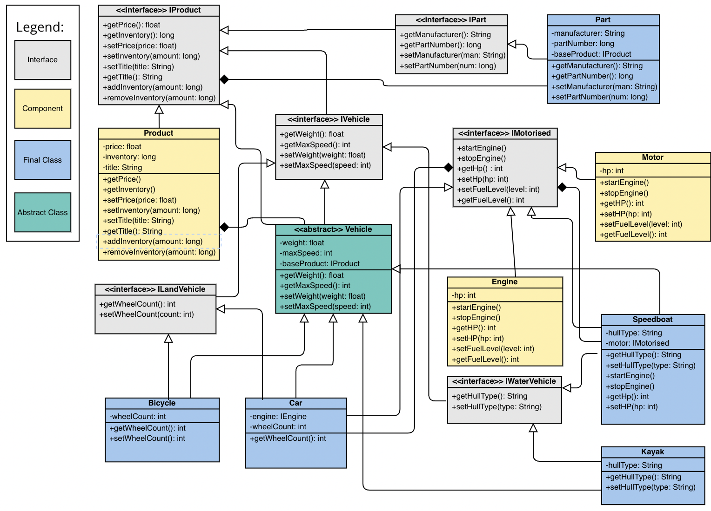

# Composition Lab: Finish the Vehicle Store

As you can see in the source code, much of the class diagram below has already been implemented, but not all of it.
Please study the diagram and **create and implement the missing interfaces and classes**, then test them in `VehicleStore`.

Hint: notice that we created a package called `land` for land-specific classes and interfaces. Consider creating a `water` package in kind.

## MVP
- create an `IWaterVehicle` interface, with the correct abstract methods.
- create a `Motor` class which implements `IMotorised`.
- create two concrete classes, called `Kayak` and `Speedboat`. Speedboat should use `Motor` compositionally.
- **All details** indicated on the UML diagram above should be implemented

## Extensions

- Create a package called `air`, for air vehicles
- Create interfaces, classes (i.e. Plane, Helicopter) and components (i.e. Radar) in the air vehicles package
- Implement instances of the concrete classes you produced, using composition
